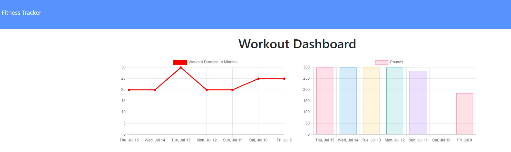

# Homework Assignment - 18 Nosql Homework: Workout Tracker

## Table of Contents
[Description](#description)

[Key Features](#key-features)

[Technology Used](#technology-used)

[License](#license)

[Links](#links)

[Screenshots](#screenshots)

## Description
This homework assignment for the University of Toronto SCS Coding Boot Camp was to build a workout tracker. Starter code was provided. The focus of this assignment was setting up the server.js file, creating a Mongo database, establishing the model, handling routes with Express, and creating the home routes and API queries that involved using Mongoose. In addition, the application is deployed using Heroku and MongoDB Atlas.

## Key Features
- User is able to view create and track daily workouts.
- User can log multiple exercises in a workout on a given day.
- User can track the name, type, weight, sets, reps, and duration of exercise. If the exercise is a cardio exercise, they can track distance traveled instead of weight, sets and reps.
- User is able to view the combined weight of multiple past exercises on the stats page.
- User can see the total duration of past workouts on the stats page.

## Technology Used
- HTML, CSS, JavaScript
- MongoDB Atlas
- Heroku
- Robo 3T
- NPM packages: express, mongoose, morgan, nodemon

## License
This product is under the MIT License.

## Links
- [GitHub repository](https://github.com/darylnauman/workout-tracker)
- [Deployed application on Heroku](https://hidden-plains-22373.herokuapp.com/)

## Screenshots
The images below show the application.

